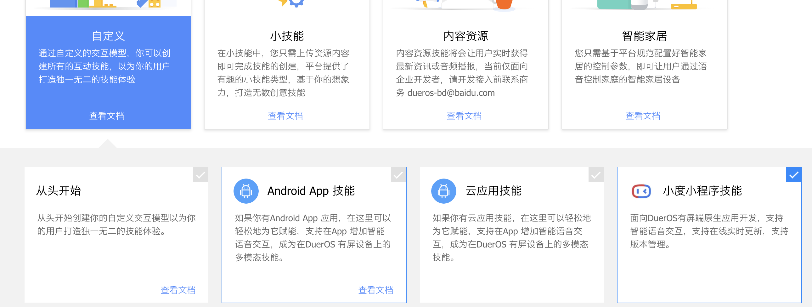
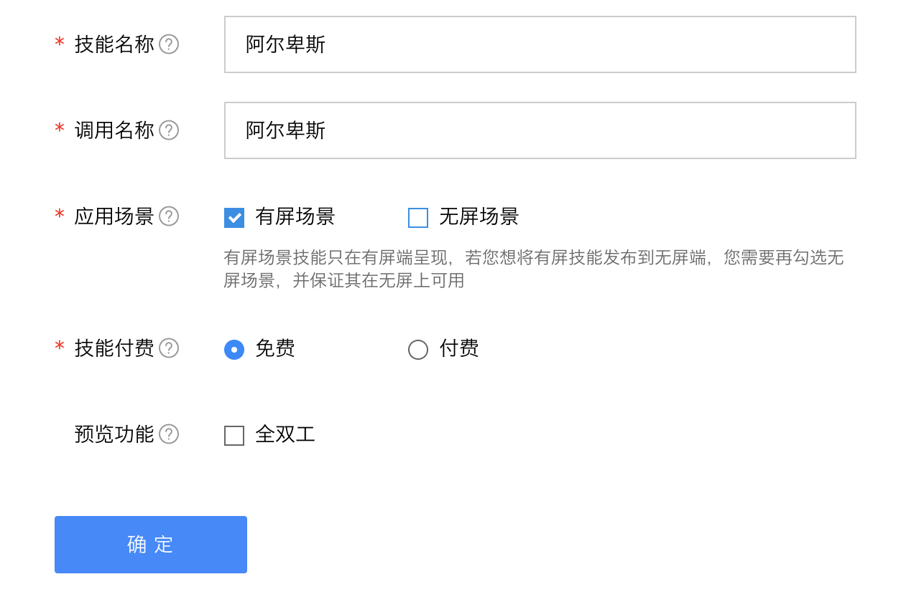
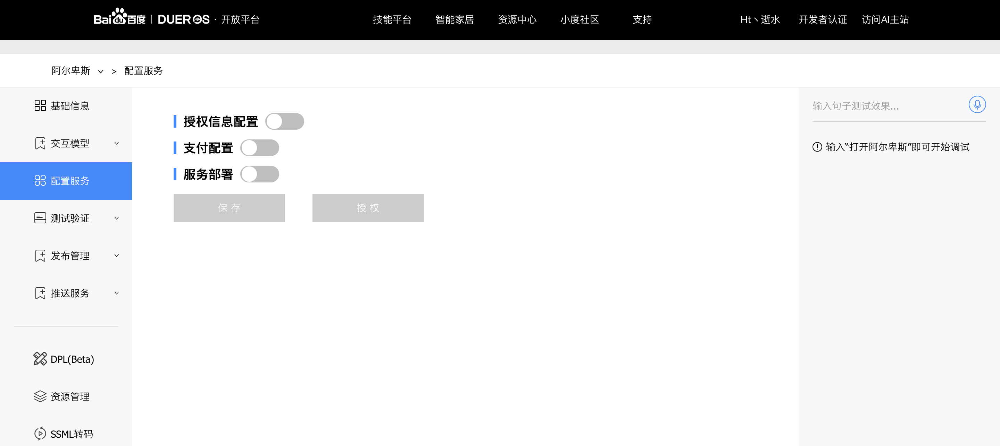
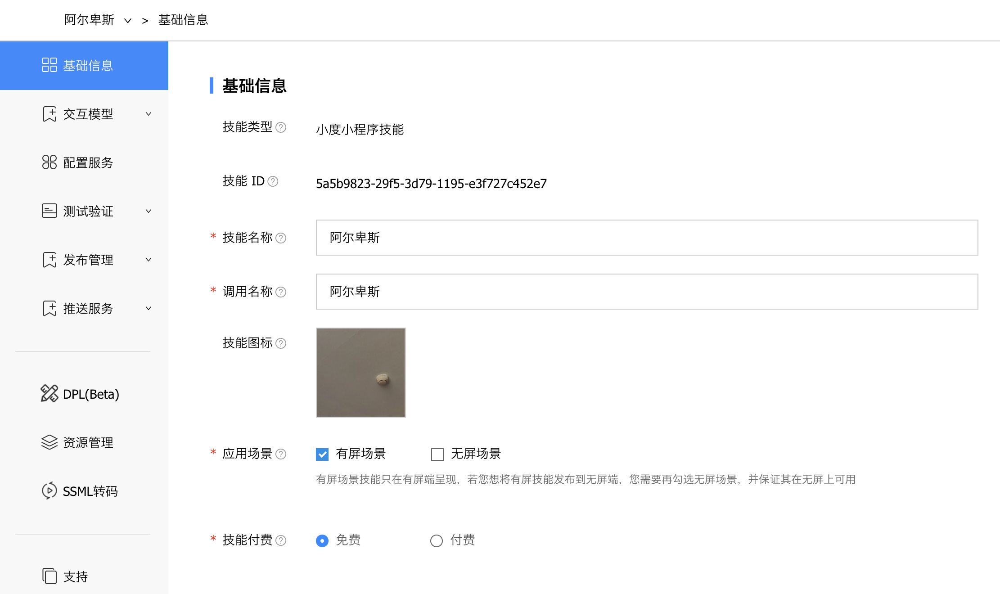
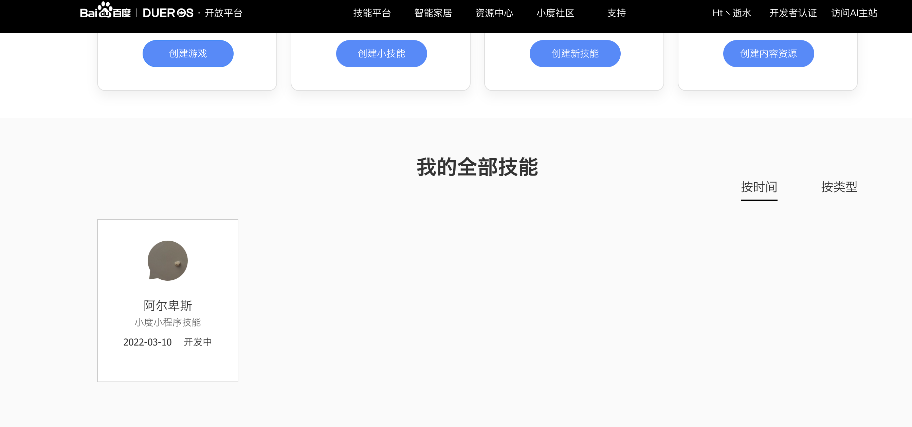
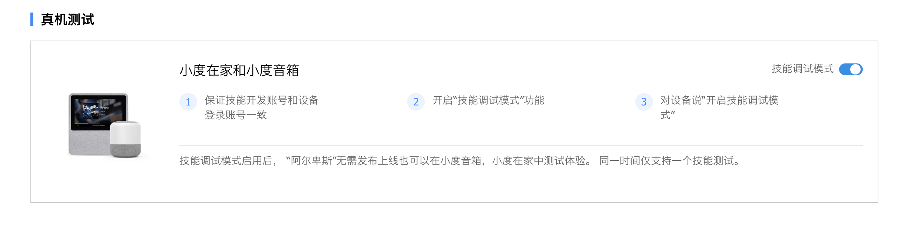
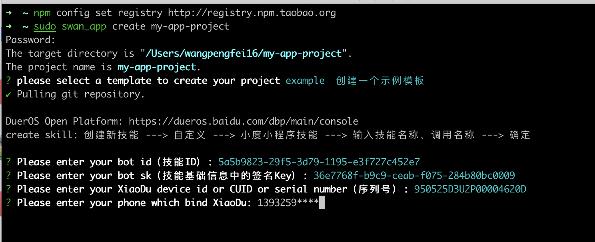

# 开始

<!-- 本文档需要说明小程序的新建、设备配置、搭建开发环境的完整流程。
参考文档：[https://developers.weixin.qq.com/miniprogram/dev/framework/quickstart/getstart.html](https://developers.weixin.qq.com/miniprogram/dev/framework/quickstart/getstart.html) -->

**开发小程序的第一步，你需要拥有一个小程序帐号，通过这个帐号你就可以管理你的小程序。**

**跟随这个教程，开始你的小程序之旅吧！**

## 登录注册

1. 打开： [百度DUEROS开放平台](https://dueros.baidu.com/dbp)
2. 点击登录/注册
3. 通过手机-百度App扫码登录，也可以在网页申请注册账号,就可以拥有自己的小程序帐号。你可以在这个平台管理你的小程序的权限，发布小程序等操作。
1. 完成登录操作后，可以在顶部菜单 `技能平台` - `控制台` 去创建我们的小程序。

## 新建小程序

* 点击[创建技能](https://dueros.baidu.com/dbp/main/console)

* 选择自定义-勾选小度小程序技能,

* 填写技能名称，这将是你的小程序名称
* 填写调用名称，这将是语音调起你的小程序的名称

**示例：我的调用名称为：阿尔卑斯**

* 应用场景选择有屏场景
* 技能方式将按照你的需要选择免费或者付费
* 点击确定

* 现在就可以在这里管理你的小程序，进行发布和测试了。

* 基础信息：你将可以在这里管理你的小程序名称和调用方式等。
* 你可以在技能图标上传的你小程序的logo。

> 注意：请保管好你的技能ID和签名Key，在搭建开发环境时需要使用。
> 

<!-- 图文说明小程序的新建流程，并告知用户找到BotID和Bot SK。 -->

## 准备好小度在家

<!-- 告知用户准备一个小度在家并绑定小度App，准备好看效果的环境 -->
**现在你需要一个小度在家的设备来查看你新建的小程序,你需要用你开发者账号（创建小度小程序的百度账号）登录小度在家，扫码登录。**

下面将带你启动你的小程序

* 前往[DUEROS开放平台](https://dueros.baidu.com/open)-技能平台-控制台-我的全部技能，就能看到账户下所有的小程序技能
* 点击打开阿尔卑斯-编辑-测试验证-真机测试，打开技能调试模式按钮
* 打开小度在家，对小度说：小度小度，打开技能调试模式
* 对小度说：小度小度，打开阿尔卑斯小程序

现在小度在家已经在运行你的小程序了。

## 搭建开发环境

1. 现在需要打开你的终端，执行以下命令：

    ```shell
    npm i swan-app-cli -g

    swan_app create my-app-project
    ```
    选择示例模板（示例模板搭建了开箱即用的开发环境）

2. 现在需要你输入 **技能ID**、**签名Key** 、 **小度在家SN序列号（SN号在小度在家底部标签）** 以及 **百度账户绑定的手机号** 
3. 完成后将会自动创建一个小度小程序开发环境
<!-- 帮助读者安装swan_app，并create一个example小程序 -->

## 编译预览

<!-- 带领开发者在小度在家上看到example小程序 -->
* 进入小程序目录，如：*my-app-project*，在小程序目录下执行：
    ``` shell
    npm i

    # 在本地启动项目调试时，小度在家设备需要关闭技能调试模式。
    npm run debug
    ```
* 现在小度在家已经在运行你的小程序。


## 帮助

```
# 查看帮助
swan_app -h
swan_app --help
# 查看版本号
swan_app -v
swan_app --version
# 在当前目录创建项目
swan_app create
# 在当前目录创建项目
swan_app create .
# 新建目录和项目
swan_app create project-name
# 强制覆盖已有目录
swan_app create project-name -f
```