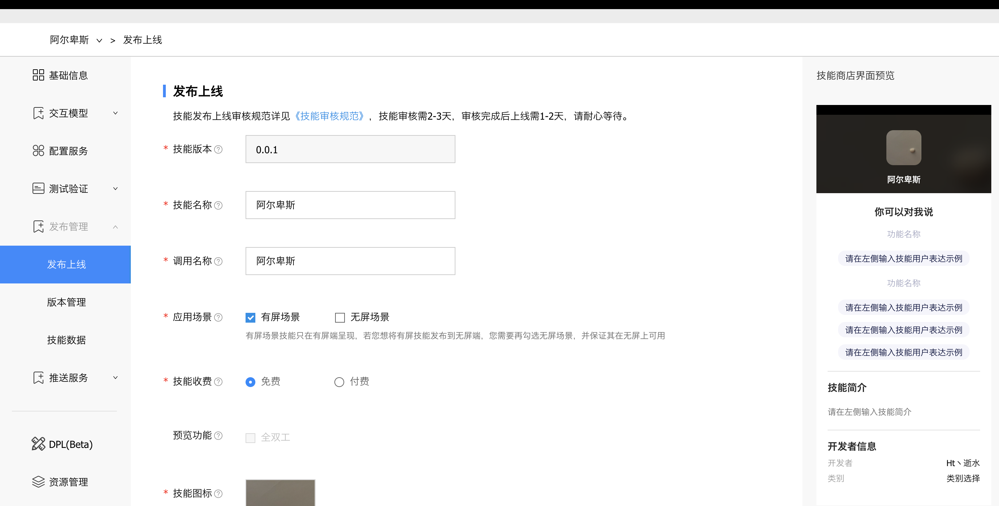

# 发布上线

<!-- 参考文档：https://developers.weixin.qq.com/miniprogram/dev/framework/quickstart/release.html#%E5%8F%91%E5%B8%83%E4%B8%8A%E7%BA%BF

说明小程序的发布上线流程。 -->

* 一个小程序从开发完到上线一般要经过 预览-> 上传代码 -> 提交审核 -> 发布等步骤。

> [百度DUEROS开放平台](https://dueros.baidu.com/dbp)-技能平台-控制台-我的全部技能-编辑
> 你可以通过[百度DUEROS开放平台](https://dueros.baidu.com/dbp)来管理你的小程序。

## 预览

* 使用真机测试可以预览你的小程序,帮助开发者检查小程序在客户端的真实表现
* 本地npm run debug启动你的本地小程序服务,语音唤醒你的小度，对小度说：小度小度，打开阿尔卑斯小程序，即可看到小程序在客户端的真实表现

## 上传代码

> 同预览不同，上传代码是用于提交体验或者审核使用的。

```shell
npm run onload
```

* 上传本地程序代码到平台进行保存。[开发者认证](https://dueros.baidu.com/didp/register/registerinfo) 这是必须的，只有开发者才能管理小程序的发布开发上线
  
**上传成功且进行开发者认证后**登录[百度DUEROS开放平台](https://dueros.baidu.com/dbp)-发布上线，就可以找到刚刚上传的小程序版本代码，进行上线操作

## 提交审核

* 为了保证小程序的质量，以及符合相关的规范，小程序的发布是需要经过审核的。

* 在发布上线的列表中，点击 申请上线 按照页面提示，填写相关的信息，即可以将小程序提交审核。

* 在开发者工具中上传了小程序代码之后，登录 [百度DUEROS开放平台](https://dueros.baidu.com/dbp) - 发布管理 - 版本管理 找到提交上传的版本。

* 需要注意的是，请开发者严格测试了版本之后，再提交审核， 过多的审核不通过，可能会影响后续的时间。

## 发布

> 审核通过之后，管理员的微信中会收到小程序通过审核的通知，此时登录 [百度DUEROS开放平台](https://dueros.baidu.com/dbp) - 发布管理 - 版本管理中可以看到通过审核的版本。点击发布后，即可发布小程序。

## 唤醒小程序

* 对小度说：小度小度，打开阿尔卑斯小程序。小度为你的小程序提供语音唤醒服务。
